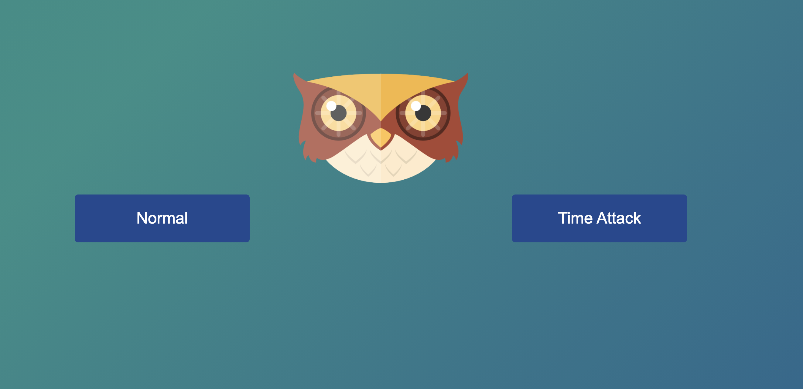
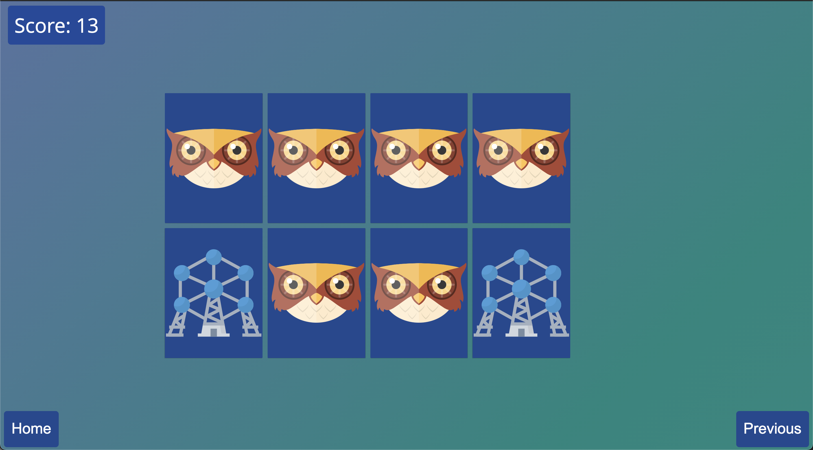
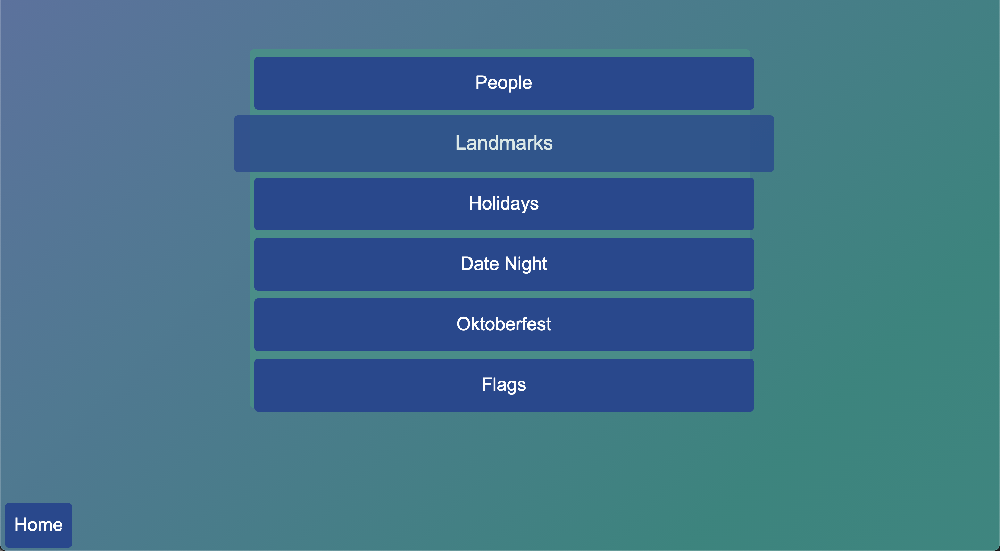
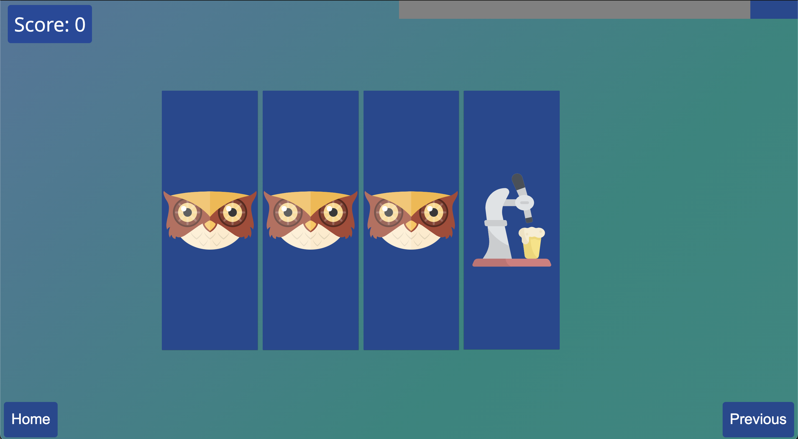

# Memory-Game

Vanilla JS game developed in my second year of university. 
Click on face-down cards to reveal the picture. Find the matching pair to keep both cards upturned. If the cards don't match, keep searching.
Time attack mode allows the player to race against the clock to upturn all the cards.

## Installation

1. Clone
2. Open index.html